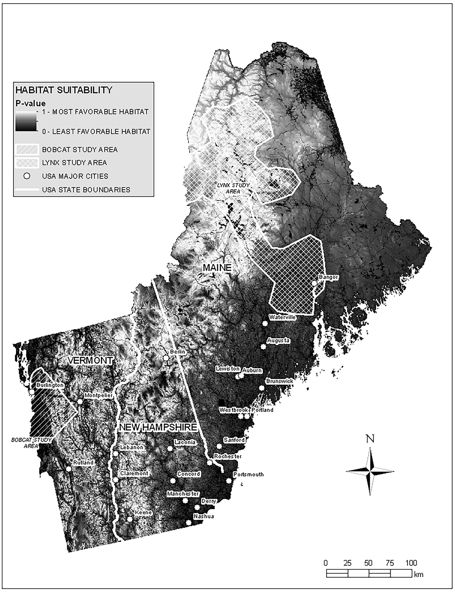

###### Github user name: SophieKent-Purcell

### A Summary of: Landscape connectivity for bobcat (*Lynx rufus*) and lynx (*Lynx canadensis*) in the Northeastern United States

Farrell, L. E., Levy, D. M., Donovan, T., Mickey, R., Howard, A., Vashon, J., Freeman, M., Royar, K., & Kilpatrick, C. W. (2018). Landscape connectivity for bobcat (*Lynx rufus*) and lynx (*Lynx canadensis*) in the Northeastern United States. *PLoS ONE*, *13*(3), e0194243. <https://doi.org/10.1371/journal.pone.0194243>

#### Introduction

Habitat fragmentation has been increasing across the Northern United States due to human expansion. This is problematic for wildlife species such as bobcat (*Lynx rufus*) and lynx (*Lynx canadensis*), which  require large amount of connected habitat for their seasonal shifts in habitat and long term gene flow within metapopulations. Creating conservation strategies to ensure species have adequate connected habitat is challenging because different species like bobcat and lynx have largely different habitat requirements and different spatial scale for these requirements. An a additional challenge is presented by the fact that in many areas, the suitability and connectivty of habitat for many species is unknown.

#### Methods

{width=75% height=75%}

#### Results and Conclusion
